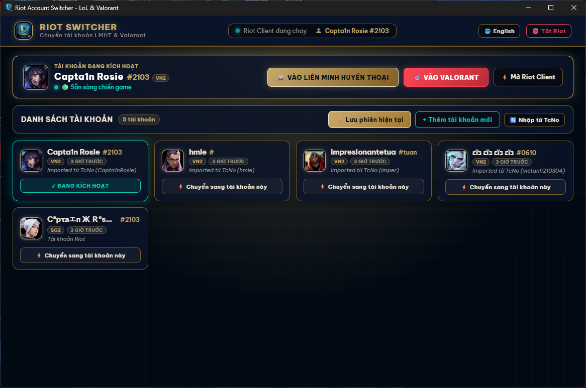

# ⚡ Riot Account Switcher (LoL & VALORANT)

<p align="center">
  
  <br>
  <strong>Trình chuyển tài khoản Riot Games nhanh, bảo mật cho Windows</strong>
  <br>
  <em>Dành cho người chơi League of Legends & VALORANT</em>
</p>

<p align="center">
  <a href="README.md">English</a> | <strong>Tiếng Việt</strong>
</p>

<p align="center">
  <a href="https://github.com/vietanh210304/riot-account-switcher/releases/latest">
    
  </a>
  
  
  <a href="LICENSE">
    
  </a>
</p>

<p align="center">
  
</p>

---

## 🌟 Tính năng chính

- ⚡ **Chuyển tài khoản tức thì bằng một cú nhấp:** Đổi qua lại giữa các tài khoản Riot Games trong vài giây mà không cần nhập lại mật khẩu hay mã 2FA.
- 🎯 **Khởi chạy game gốc & tự động lấy nét:** Mở League of Legends hoặc VALORANT qua trình khởi chạy chính thức của Riot (`RiotClientServices.exe`). Nếu game đang chạy, ứng dụng tự chuyển và đưa cửa sổ game lên trước.
- 🦀 **Giao diện Rust gốc hoàn toàn (egui/eframe):** Một ứng dụng desktop gốc, tự chứa — không nhúng trình duyệt, không cần WebView2, không cần Python. Khởi động nhanh, dung lượng nhỏ, hiển thị gốc.
- 🌐 **Hỗ trợ song ngữ (Tiếng Việt & English):** Chuyển đổi ngôn ngữ tức thì giữa tiếng Việt và tiếng Anh trên mọi màn hình và hộp thoại.
- 🖱️ **Menu chuột phải & chỉnh sửa trực tiếp:**
  - Sửa Riot ID hiển thị & tag (`#tag`).
  - Thêm ghi chú cho tài khoản.
  - Chọn từ **24 avatar ngoại tuyến chính thức** (12 tướng LoL + 12 đặc vụ VALORANT).
  - Sao chép nhanh Riot ID vào clipboard.
  - Xoá tài khoản an toàn với hộp thoại xác nhận trong ứng dụng.
- 🛡️ **Riêng tư 100% & lưu trữ cục bộ:** Token phiên đăng nhập và dữ liệu snapshot chỉ nằm trên máy bạn. Không telemetry, không máy chủ từ xa, không thu thập dữ liệu.
- 🧹 **Dọn dẹp dung lượng tích hợp:** Dọn rác cấu hình còn sót (`ClientConfiguration.json` / `lockfile` cũ) mà các bản trước đã sao chép vào snapshot tài khoản — giải phóng dung lượng và khắc phục lỗi "game không mở được" do lockfile cũ, mà không đụng tới thông tin đăng nhập đã lưu.

---

## 📥 Tải bản phát hành mới nhất

👉 Tải gói dựng sẵn tại **[Releases](https://github.com/vietanh210304/riot-account-switcher/releases/latest)**:

- 📦 **Bản cài đặt (`RiotAccountSwitcher-Setup.exe`):** Trình cài đặt Windows tiêu chuẩn, tạo lối tắt Start Menu, biểu tượng Desktop và trình gỡ cài đặt trong Windows Settings.
- 🚀 **Bản portable (`riot-account-switcher.exe`):** File thực thi độc lập một file, không cần cài đặt. Chạy trực tiếp từ bất kỳ đâu!

---

## 🛠️ Phát triển & Tự build từ mã nguồn

### Yêu cầu:
- Windows 10 / 11 (64-bit)
- [Bộ công cụ Rust](https://rustup.rs/) (stable). Trên Windows, toolchain **GNU** được hỗ trợ đầy đủ và không cần cài Visual Studio:
  ```bash
  rustup default stable-x86_64-pc-windows-gnu
  ```
- Một bộ công cụ C cho linker (ví dụ [WinLibs MinGW-w64](https://winlibs.com/)) có trong `PATH`.

### Cài đặt:
```bash
git clone https://github.com/vietanh210304/riot-account-switcher.git
cd riot-account-switcher
```

### Chạy ở chế độ phát triển:
```bash
cargo run
```

### Build bản release tối ưu:
```bash
cargo build --release
```
File thực thi được tạo tại `target/release/riot-account-switcher.exe`. Ứng dụng đọc ảnh avatar từ thư mục `assets/` cạnh file thực thi (hoặc từ thư mục dự án khi phát triển).

### Tạo trình cài đặt Windows:
Build bản release trước, rồi dựng `installer.iss` bằng [Inno Setup](https://jrsoftware.org/isinfo.php):
```bash
iscc installer.iss
```
Trình cài đặt được tạo tại `dist/RiotAccountSwitcher-Setup.exe`.

---

## ⚖️ Giấy phép & Miễn trừ trách nhiệm

Phát hành theo [Giấy phép MIT](LICENSE).

*Miễn trừ trách nhiệm:* Riot Account Switcher là tiện ích không chính thức, không liên kết, không được Riot Games, Inc. xác nhận hay tài trợ. Riot Games, League of Legends và VALORANT là thương hiệu hoặc thương hiệu đã đăng ký của Riot Games, Inc.
